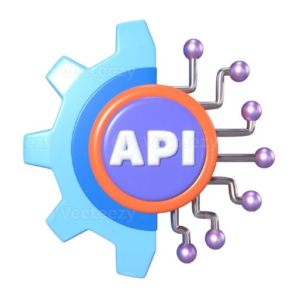

# Library Management System

<br>
<div align="center">
  <a href="https://github.com/mantle-bearer/library_management">
    
  </a>

  <h3 align="center">RESTful API for Library Management</h3>

  <p align="center">
    An awesome RESTful API that allows you to manage a library!
    <br />
    <a href="https://github.com/mantle-bearer/library_management"><strong>Explore the docs »</strong></a>
    <br />
    <br />
    <a href="https://librarymanagement-chi.vercel.app/swagger">View Demo</a>
    &middot;
    <a href="https://documenter.getpostman.com/view/41332874/2sAYX3q32L#8c57ec9c-f6c0-48e7-8558-069c4eca5950">View Documentation</a>
    &middot;
    <a href="https://github.com/mantle-bearer/library_management/issues/new?labels=bug&template=bug-report---.md">Report Bug</a>
    &middot;
    <a href="https://github.com/mantle-bearer/library_management/issues/new?labels=enhancement&template=feature-request---.md">Request Feature</a>
  </p>
</div>

This RESTful API for Library Management that allows you to manage a library system with CRUD operations for books, including rate-limiting to ensure fair usage. Authentication is not required.

## Features

- Book Management (CRUD)
- Borrowing and Returning Books
- User Management (Admin Interface)
- REST API for Integration
- Rate Limiting for API Endpoints

## Requirements

- Python 3.13.1
- Django 4.2
- Vercel CLI

## Installation

1. Clone the repository:

   ```bash
   git clone https://github.com/mantle-bearer/library_management.git
   cd library_management
   ```

2. Create and activate a virtual environment:

   ```bash
   python -m venv venv
   source venv/bin/activate  # On Windows, use `venv\Scripts\activate`
   ```

3. Install the required packages:

   ```bash
   pip install -r requirements.txt
   ```

4. Collect static files:

   ```bash
   python manage.py collectstatic
   ```

5. Run the development server:
   ```bash
   python manage.py runserver
   ```

## Endpoints

### 1. Retrieve All Books

**GET** `api/v1/books`

Retrieve a list of all books in the library.

#### Request:

- **Query Parameters:**
  ```cURL
      curl --location 'https://librarymanagement-chi.vercel.app/api/v1/books'
  ```

#### Response:

```json
[
  {
    "id": 1,
    "title": "The Great Gatsby",
    "author": "F. Scott Fitzgerald",
    "genre": "Classic Fiction",
    "publication_date": "1925-04-10",
    "availability": "available",
    "edition": "3rd",
    "summary": "A novel about the corruption of the American Dream."
  },
  {
    "id": 2,
    "title": "Alexander the great",
    "author": "Luther King",
    "genre": "Classic Fiction",
    "publication_date": "1927-04-13",
    "availability": "unavailable",
    "edition": "5th",
    "summary": "A corruption of the American Dream."
  }
]
```

## Deployment

### Vercel

1. Install Vercel CLI:

   ```bash
   npm install -g vercel
   ```

2. Initialize Vercel in your project:

   ```bash
   vercel
   ```

3. Follow the prompts to set up your project.

4. Configure your `vercel.json`:

   ```json
   {
     "version": 2,
     "builds": [
       {
         "src": "library_management/wsgi.py",
         "use": "@vercel/python",
         "config": {
           "distDir": "build"
         }
       }
     ],
     "routes": [
       {
         "src": "/(.*)",
         "dest": "library_management/wsgi.py"
       }
     ]
   }
   ```

5. Deploy your project:
   ```bash
   vercel --prod
   ```

## Environment Variables

Ensure the following environment variables are set for your project in Vercel:

- `DJANGO_SETTINGS_MODULE=library_management.settings`
- `SECRET_KEY=your_secret_key`
- `DEBUG=False`

## Troubleshooting

- **500: INTERNAL_SERVER_ERROR**: Check Vercel logs for detailed error messages and ensure all dependencies are correctly installed.
- **Static Files Not Loading**: Ensure `collectstatic` command is run and `STATIC_ROOT` is correctly set in `settings.py`.

## Acknowledgements

- **[Django](https://www.djangoproject.com/)** - The web framework used to build this application.
- **[Vercel](https://vercel.com/)** - For providing an excellent platform to deploy serverless functions.
- **[drf-yasg](https://github.com/axnsan12/drf-yasg)** - For the automatic generation of Swagger documentation.
- **[GitHub](https://github.com/)** - For hosting the project repository.

## Contributing

Feel free to contribute to the project by opening a pull request or filing an issue.

## License

This project is licensed under the MIT License - see the [LICENSE](LICENSE) file for details.
